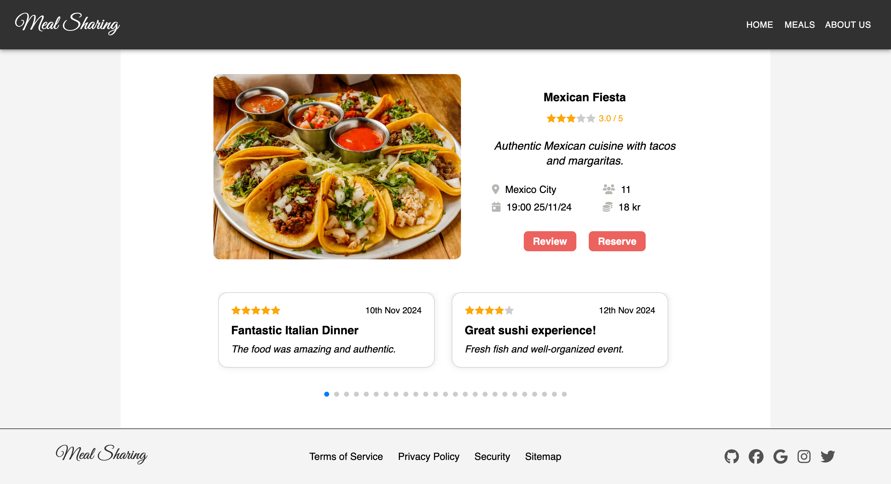

# Meal Sharing App

## Description

This is a full-stack web application built with JavaScript, Express.js, React, and MySQL.

It was created as an individual project task for [Hack Your Future](https://github.com/HackYourFuture-CPH) Denmark's curriculum.

💡 Key features of the project:

🍽️ Displaying meals from the database.

🔍 Searching for a meal.

📅 Making a reservation.

✍️ Leaving a review for a meal.

📈 Sorting meals by different criteria.

🧹 Filtering meals to find the perfect option.

🔍 View available meals and see detailed information for each one.

## Technologies Used

-   Express.js
-   Knex.js
-   MySQL
-   React
-   Node.js
-   CSS
-   Swiper.js
-   Material UI
-   Vite

## What I Learned

During the development of this project, I faced several challenges that helped me learn new skills and technologies.

Through these challenges, I was able to gain a better understanding of React, CSS Modules, and Frontend Development in general. I also learned how to work with Express.js, KnexJS, and MySQL to build a full-stack web application.

In addition to these technical skills, I also learned how to manage my time effectively and prioritize tasks to meet deadlines.

Overall, this project was a great learning experience for me and helped me grow as a developer.

## Screenshots

